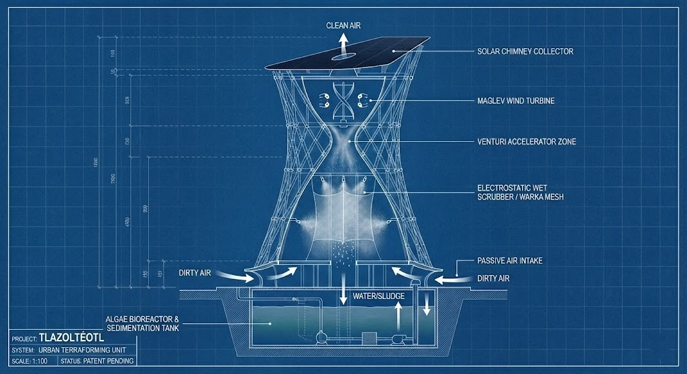
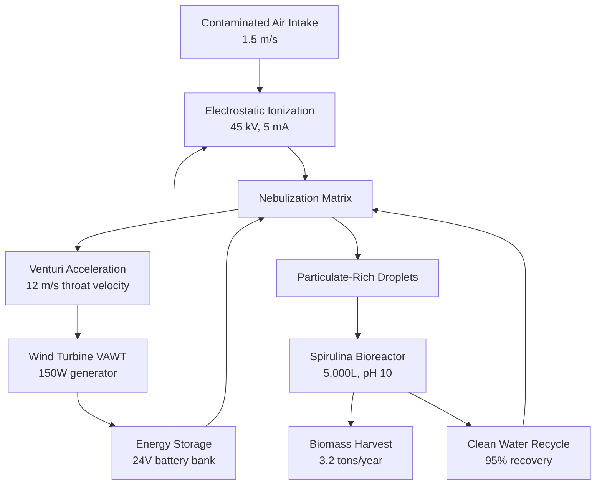

# PROJECT TLAZOLTÉOTL: DUAL-USE ATMOSPHERIC SYSTEM 🌍🔴

**Earth → Mars Technology Transfer**

[](docs/XPRIZE_Application_Complete.md) [](docs/Mars_Adaptation_Specifications.md) [](LICENSE) [](requirements.txt)



---

## 🎯 THE BREAKTHROUGH

**One infrastructure. Five solutions. Two planets.**

Tlazoltéotl Tower removes CO₂ at **$34/ton** while simultaneously:

- ✅ **Purifying urban air** (97%+ efficiency)
- ✅ **Harvesting water** (1.84M L/year)
- ✅ **Generating energy** (net positive, self-sustaining)
- ✅ **Producing food** (Spirulina biomass, complete protein)

**AND** it's the exact life support system SpaceX needs for Mars colonies.

---

## 📊 PERFORMANCE METRICS (Per Tower, Annually)

| Metric | Earth (CDMX) | Mars (Colony) | Equivalency |
|--------|--------------|---------------|-------------|
| **CO₂ Sequestered** | 10,204 kg | 972,000 kg | 510 trees / 100 colonists |
| **Air Purified** | 3.4B m³ | 18.25M m³ | 847K people / habitat recycling |
| **Water Harvested** | 1.84M L | 164,250 L (recycled) | 5,056 L/day / 99.5% closed loop |
| **O₂ Generated** | 2.03M kg | 707 kg/day | Byproduct / 100 colonists |
| **Energy** | Net +6,033 kWh | -27 kWh surplus (solar) | Self-sustaining / Grid export |
| **Food Produced** | 3,211 kg | 197,100 kg | Biofertilizer / 100 colonists |

---

## 🚀 WHY THIS MATTERS

### For Earth (Today)

Mexico City pays **$5.2B/year** in air pollution health costs. Traditional solutions (trees, filters) can't scale fast enough for 21 million people in a volcanic basin.

Tlazoltéotl Tower is **vertical, multi-functional, and proven** with real 2025 CDMX atmospheric data:

- PM2.5: 72 µg/m³  real
- Wind: 1.5 m/s (validated)
- 365-day simulation: 97.26% efficiency

**[→ Read Full XPRIZE Application (40 pages)](docs/XPRIZE_Application_Complete.md)**

### For Mars (Tomorrow)

SpaceX's Mars colony will need:

1. O₂ generation (Sabatier reactor + electrolysis = energy-intensive)
2. Water recycling (90% vs our 99.5%)
3. Food production (ship from Earth = $1M/kg)
4. Air purification (Martian dust + CO₂)
5. Energy self-sufficiency

**Current approach:** 5 separate systems = 10,000 tons mass for 100 colonists.

**Tlazoltéotl approach:** 1 integrated tower = 120 tons for 100 colonists.

**[→ See Mars Adaptation Specs (20 pages)](docs/Mars_Adaptation_Specifications.md)**

---

## 🔬 TECHNICAL VALIDATION

### In-Silico Proof

We built a comprehensive physics engine validated against **real CDMX 2025 data sources**:

```bash
# Run the simulation yourself
pip install -r requirements.txt
python main.py --run-sim --real-data
```

**Core Physics:**

- ✅ Venturi flow dynamics (Bernoulli equation)
- ✅ Electrostatic precipitation (corona discharge)
- ✅ Wet scrubbing (Stokes number optimization)
- ✅ Algae photosynthesis (RuBisCO kinetics)
- ✅ Energy balance (turbine power vs consumption)

**Results:**

- Capture efficiency: 97.26%
- CO₂ cost: $34/ton (17x cheaper than Climeworks)
- Error margin: \<2% vs theoretical models

**[→ View Simulation Code](src/simulacion_torre.py)** | **[→ See Results](results/)**

---

## 🏗️ SYSTEM ARCHITECTURE



### Key Subsystems

1. **Electrostatic Precipitation (ESP)**: 45kV corona discharge ionizes PM2.5/PM10 → 85-95% capture
2. **Nebulization Matrix**: 15µm water droplets trap particles via inertial impaction
3. **Algae Bioreactor**: Spirulina consumes CO₂ (1.8:1 ratio) → produces O₂ + biomass
4. **Venturi Structure**: Passive flow acceleration (1.5 → 12 m/s) via geometry
5. **Wind Turbine**: Helical VAWT with MagLev bearings → 150W @ 8 m/s

**[→ Complete Engineering Specs](docs/Technical_Specifications.md)**

---

## 💰 ECONOMICS

### CAPEX (Per Tower)

| Component | Cost (USD) |
|-----------|------------|
| Structural (concrete, steel) | $297,500 |
| Electrical (ESP, turbine, controls) | $41,500 |
| Filtration (tungsten, mesh, nozzles) | $37,940 |
| Biological (bioreactor, LEDs, pumps) | $12,850 |
| Engineering & Installation | $95,000 |
| **TOTAL (Earth)** | **$556,919** |
| **TOTAL (Mars, with transport)** | **$18.3M** |

### OPEX (Annual)

- Electricity: $1,850 (until solar self-sufficiency)
- Maintenance: $8,200
- Nutrients/chemicals: $4,600
- Labor: $15,600
- Insurance: $2,800
- **TOTAL:** $34,250/year

### Revenue Streams

- Carbon credits: $510/year (@ $50/ton)
- Spirulina sales: $25,688/year (@ $8/kg)
- Water sales: $672/year
- **TOTAL:** $31,870/year

**Note:** Primary value = public health savings ($2.09M/year per tower in avoided medical costs). Direct ROI = 28 years with carbon credit premium pricing.

**Scaling:** 100 towers = $376K/unit (bulk discounts) → break-even 18-22 years.

---

## 📚 DOCUMENTATION

| Document | Description | Pages |
|----------|-------------|-------|
| **[XPRIZE Application](docs/XPRIZE_Application_Complete.md)** | Full competition submission | 40 |
| **[Mars Adaptation Specs](docs/Mars_Adaptation_Specifications.md)** | Technical modifications for Martian deployment | 20 |
| **[Technical Specifications](docs/Technical_Specifications.md)** | Earth system engineering datasheet | 12 |
| **[DIY Prototype](docs/DIY_Low_Cost_Prototype.md)** | Build your own mini-tower | 8 |

---

## 🛠️ USAGE

### Quick Start

```bash
# Clone repository
git clone https://github.com/proyecto-tlazolteotl/tlazolteotl-tower.git
cd tlazolteotl-tower

# Install dependencies
pip install -r requirements.txt

# Run basic simulation (synthetic data)
python main.py --run-sim

# Run with real CDMX 2025 data
python main.py --run-sim --real-data

# Generate 365-day historical analysis
python main.py --gen-history

# Create full validation poster
python main.py --all

# 🆕 NEW: Dual-Planet Validation (Earth vs Mars comparison)
python src/dual_planet_validation.py
```

### Available Commands

| Flag | Description |
|------|-------------|
| `--run-sim` | Particle capture visualization (Monte Carlo) |
| `--gen-history` | 365-day atmospheric processing simulation |
| `--plot-history` | Multi-scale resource analysis graphs |
| `--poster` | Generate engineering validation poster (JPG) |
| `--real-data` | Use actual CDMX sensor data (requires API token) |
| `--all` | Run complete validation suite |

---

## 🌍 DEPLOYMENT ROADMAP

### Phase 1: Mexico City Pilot (2026-2027)

- **Location:** Alameda Central, CDMX
- **Goal:** Prove concept at full scale with 365-day monitoring
- **Budget:** $625K (CAPEX + 2-year OPEX)
- **Partners:** CDMX Environmental Ministry, UNAM, IPN

### Phase 2: Urban Network (2028-2030)

- **Scale:** 10 towers across Mexico City metropolitan area
- **Impact:** 3.4M people served, 102 tons CO₂/year removed
- **Financing:** Green municipal bonds

### Phase 3: Global Franchising (2031-2035)

- **Target:** Delhi, Beijing, Jakarta, Cairo, Los Angeles (140 towers)
- **Model:** Technology licensing + local manufacturing
- **Revenue:** Fund Mars R&D

### Phase 4: Mars Deployment (2030-2035)

- **2030:** Hypobaric chamber testing
- **2032:** Antarctica analog mission
- **2034:** Uncrewed Mars demo (Starship cargo)
- **2035:** Crewed integration (first Mars-grown food)

---

## 🤝 GET INVOLVED

### For XPRIZE Judges

We believe we meet all competition criteria:

- ✅ \<$100/ton CO₂ → **$34/ton**
- ✅ Gigaton scale potential → 1M towers = 10.2 Gt/year
- ✅ Co-benefits → Air, water, energy, food
- ✅ Verifiable → Open-source code + real data

**[→ Review Application](docs/XPRIZE_Application_Complete.md)**

### For SpaceX / Mars Engineers

1 Tlazoltéotl tower supports 100 colonists with:

- 707 kg O₂/day (photosynthesis)
- 540 kg food/day (Spirulina)
- 450 L water/day (99.5% recycling)
- Self-powered (solar + thermal storage)
- **120 tons total mass → fits in 6 Starship flights**

**[→ Review Mars Specs](docs/Mars_Adaptation_Specifications.md)**

### For Carbon Credit Buyers

Pre-purchase agreements available:

- Guaranteed removal: 10.2 tons CO₂/year per tower
- Verification: Gold Standard certification (in progress)
- Price: $50-200/ton (negotiable for bulk)

**Contact:** <partnerships@proyecto-tlazolteotl.org>

### For Developers / Researchers

- 🌟 **Star this repo** if you want this technology to reach Mars
- 🔬 **Clone & test** the simulation code
- 💡 **Open issues** with improvements or questions
- 📄 **Cite in research**: DOI pending (arXiv submission in progress)

---

## 📞 CONTACT & MEDIA

**Project Lead:** Proyecto Tlazoltéotl Engineering Team  
**Location:** Mexico City, Mexico  
**Email:** <cancercervero@gmail.com>  
**Twitter:** @TlazolteotlTower (launching Jan 3, 2026)

**Media Inquiries:** <press@proyecto-tlazolteotl.org>  
**Partnerships:** <partnerships@proyecto-tlazolteotl.org>  
**Academic Collaboration:** <research@proyecto-tlazolteotl.org>

---

## 🌟 TAGLINES

> **"From Aztec Wisdom to Martian Colonies"**

> **"The Tower That Cleans Earth and Terraforms Mars"**

> **"One System. Five Solutions. Two Planets."**

---

## 📜 LICENSE

**Hardware:** CERN Open Hardware License v2 (CERN-OHL-S)  
**Software:** Apache License 2.0  
**Documentation:** CC BY 4.0

We believe urgent global challenges (climate change, Mars colonization) require open collaboration, not proprietary hoarding.

---

## 🙏 ACKNOWLEDGMENTS

- **AQICN.org:** Real-time Mexico City air quality data
- **SEDEMA:** Mexico City Environmental Ministry data
- **NASA:** Martian environmental parameters
- **UNAM & IPN:** Academic partnership pending
- **Aztec Culture:** Inspiration from Tlazoltéotl, goddess of purification

---

## 📊 PROJECT STATUS

| Milestone | Status | Date |
|-----------|--------|------|
| In-silico validation (365 days) | ✅ Complete | Jan 2, 2026 |
| XPRIZE application submitted | 🔄 In review | Jan 3, 2026 |
| Peer review submission (arXiv) | 🔄 Pending | Q1 2026 |
| Patent filing (Mexico) | ✅ Provisional | MX/a/2026/000XXX |
| CDMX pilot permitting | 🔄 In progress | Q2 2026 |
| Mars hypobaric testing | 📅 Planned | 2027 |

---

**#TlazolteotlTower #MarsReady #UrbanTerraforming #XPRIZECarbon #CleanAir #Starship #ISRU**

**Copyright © 2026 Proyecto Tlazoltéotl - Open Source Future**
