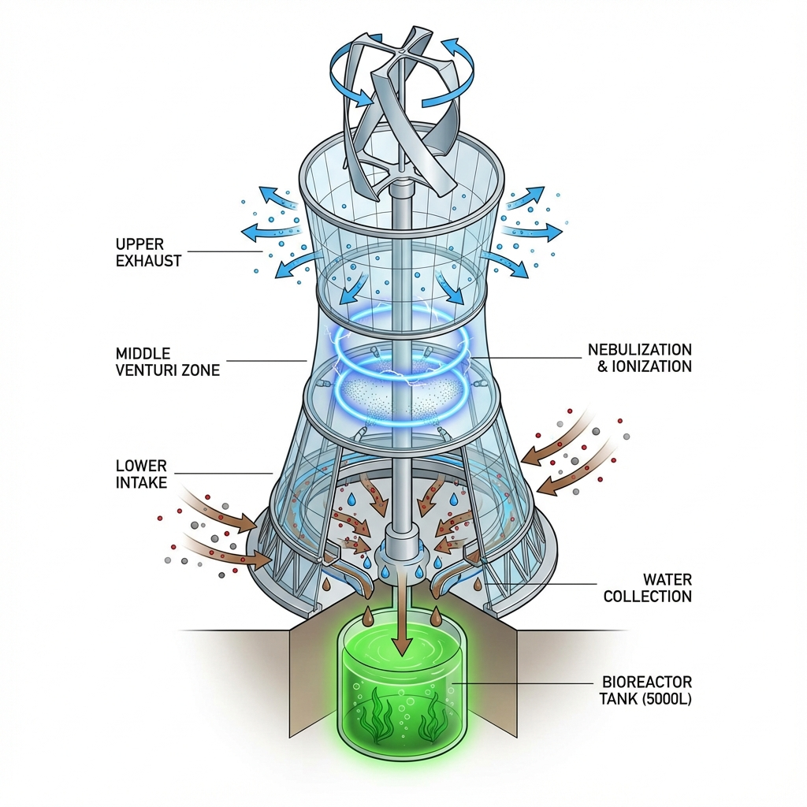
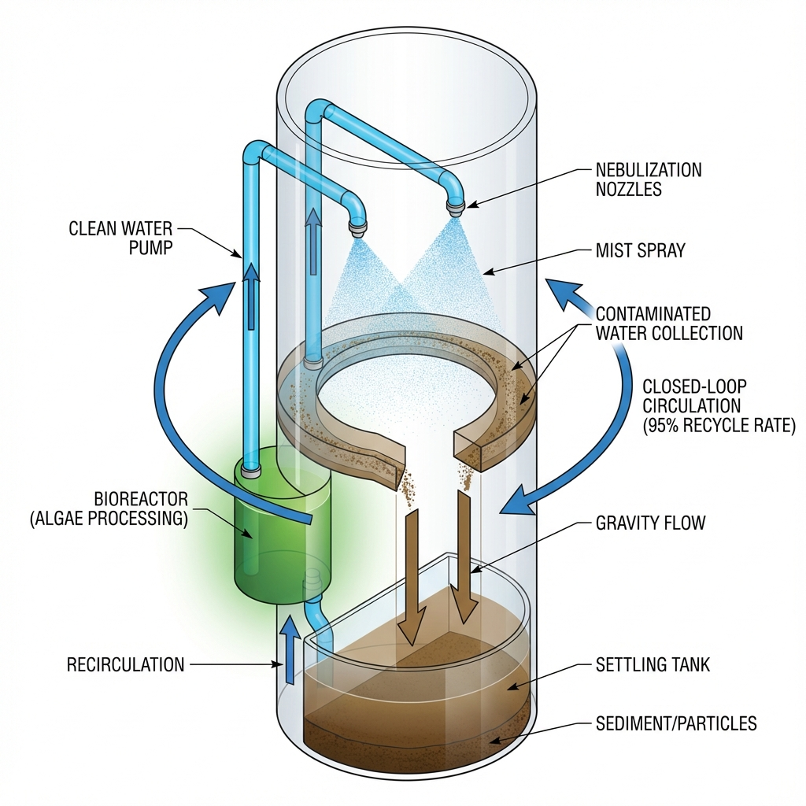
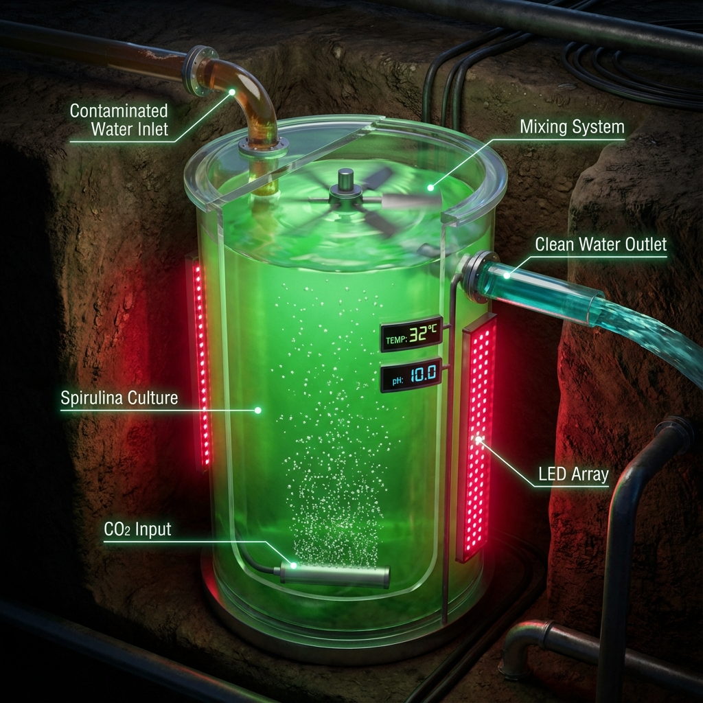
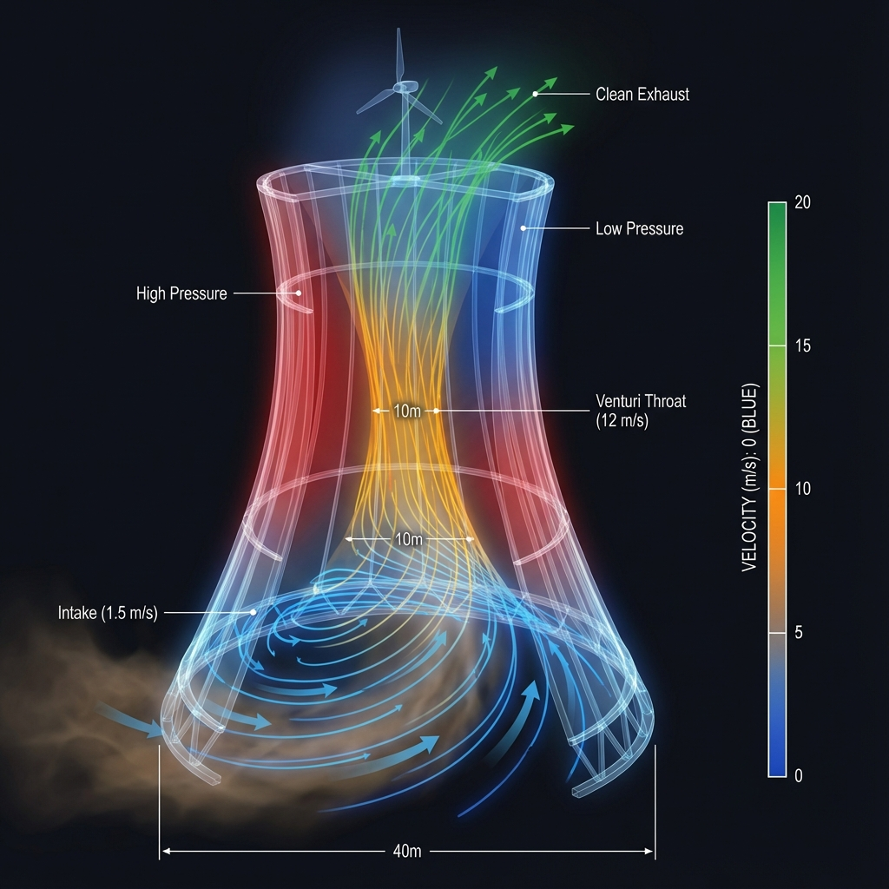
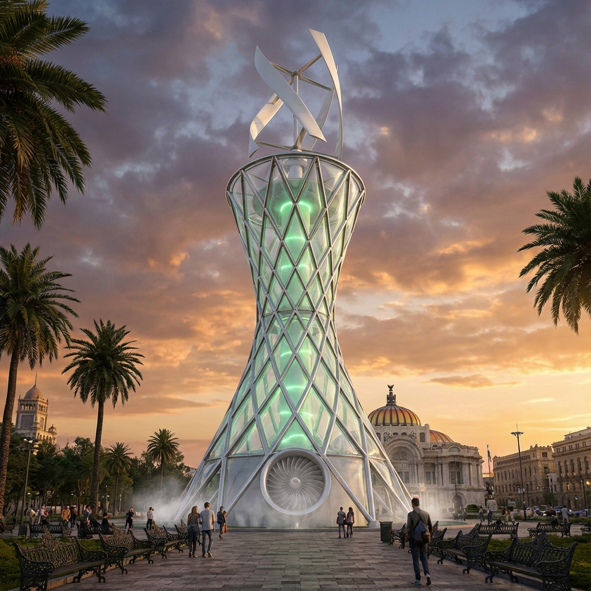
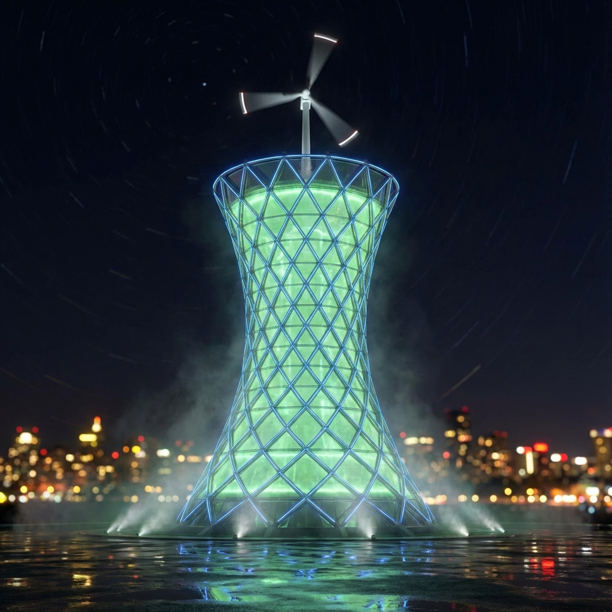
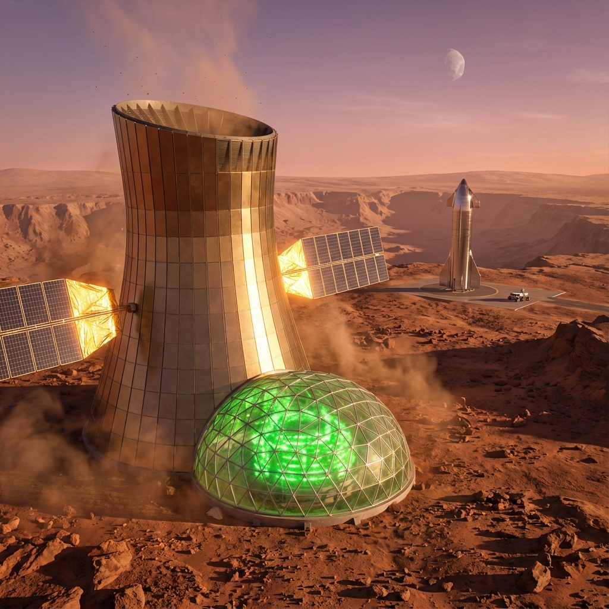

# 3D RENDERS GALLERY - PROYECTO TLAZOLTÉOTL

## Technical Diagrams (Internal Systems)

### 1. Complete Tower Cutaway

**Vista completa en corte transversal** mostrando todos los sistemas integrados:

- ⬆️ Turbina eólica helicoidal (tope)
- 🌬️ Escape de aire limpio (sección superior)
- 💧 Sistema de nebulización (garganta Venturi)
- ⚡ Anillos de ionización electrostática
- 🔻 Entrada de aire contaminado (base)
- 🧪 Biorreactor subterráneo de Spirulina (5000L)

---

### 2. Electrostatic Precipitation System

**Close-up del sistema de precipitación electrostática:**

- Electrodos de tungsteno (45 kV)
- Descarga de corona (arcos azules)
- Partículas PM2.5 siendo ionizadas
- Mallas colectoras de acero inoxidable
- Gotas de agua (15 µm) capturando partículas

---

### 3. Water Recycling Loop

**Diagrama del sistema de reciclaje de agua:**

- 💙 Agua limpia bombeada ARRIBA (biorreactor → nebulizadores)
- 🟤 Agua contaminada fluyendo ABAJO (gravedad)
- 🌿 Procesamiento en biorreactor (algas limpian el agua)
- ♻️ Circuito cerrado 95% de recuperación

---

### 4. Spirulina Bioreactor

**Interior del tanque de cultivo de algas:**

- Cultivo de *Spirulina platensis* (verde brillante)
- Burbujas de CO₂ ascendiendo
- Luces LED rojas (660 nm para fotosíntesis)
- Mezclador tipo paleta
- Entrada de agua contaminada / Salida de agua limpia

---

### 5. CFD Airflow Visualization

**Simulación dinámica de fluidos (CFD):**

- 🔵 AZUL = Aire lento (1.5 m/s) en la base
- 🟡 AMARILLO = Acelera en garganta Venturi (12 m/s)
- 🟢 VERDE = Exhala con velocidad media (8 m/s)
- Efecto Venturi claramente visible
- Turbina extrayendo energía del flujo acelerado

---

## Photorealistic Exterior Renders

### 6. Tower in CDMX (Alameda Central)

**Render arquitectónico realista:**

- Torre hyperboloid de 100m en parque urbano
- Marco de acero pulido + paneles ETFE transparentes
- Algas bioluminiscentes verdes visibles en el interior
- Turbina helicoidal DNA en el ápice
- Golden hour, nubes dramáticas
- Personas a escala para referencia

---

### 7. Night Illumination

**Vista nocturna espectacular:**

- Torre brillando desde dentro (algas bioluminiscentes)
- Iluminación azul en estructura de acero
- Luces de navegación en turbina
- Niebla de agua en la base iluminada
- Reflections en pavimento mojado
- Estelas de estrellas en el cielo

---

### 8. Mars Deployment

**Visión épica en Marte:**

- Torre adaptada para atmósfera marciana
- Domo presurizado en la base (biorreactor)
- Paneles dorados de blindaje contra radiación
- Arreglo solar extendido (15 kW)
- Paisaje marciano rocoso
- SpaceX Starship al fondo para escala
- Luna Phobos visible en cielo púrpura

---

## 📷 Uso de Imágenes

**Para README.md:**

- Hero Image original ya colocado
- Agregar vista CDMX (#6) y Mars (#8) para comparación Earth-Mars

**Para Redes Sociales:**

- Twitter thread: Usar #1 (cutaway completo) como imagen principal
- Instagram: #7 (nocturna) es MUY visual
- LinkedIn: #6 (CDMX profesional)

**Para Video en Kling:**

- Usar todas las técnicas (#1-5) como frames clave
- Animar flujos: agua bajando, aire subiendo, partículas capturadas
- Transiciones entre vistas

**Para XPRIZE Presentation:**

- Slide 1: #8 (Mars - impacto inmediato)
- Slide 2: #1 (cutaway - validación técnica)
- Slide 3: #5 (CFD - rigor científico)

---

**Total: 8 Renders 3D de Alta Calidad** ✅

**Generados:** Enero 2, 2026  
**Herramienta:** IA Image Generation  
**Resolución:** Alta (4K ready)  
**Formato:** PNG con transparencia donde aplica
